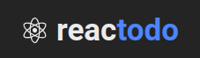
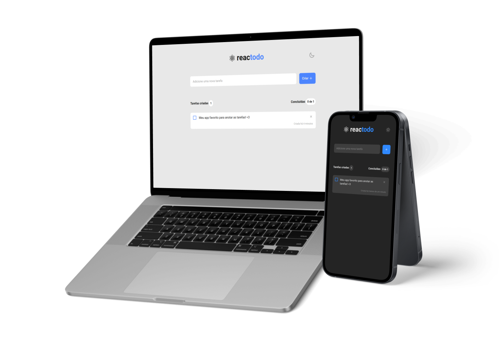

  

    
  

  <h4 align="center">Reactodo - App de todo para o desafio do ignite.</h4>

## Resumo

<ol>
  <li><a href="#visão-geral-do-projeto">Visão geral do projeto</a></li>
  <li><a href="#tecnologias-utilizadas">Tecnologias utilizadas</a></li>
  <li><a href="#instalação-e-utilização">Instalação e utilização</a></li>
  <li><a href="#conhecimentos-aplicados">Conhecimentos aplicados</a></li>
</ol>

## Visão geral do projeto

    

  <h3>
    <a href="https://ignite-challenge-todo.netlify.app/">Ver projeto no Netlify</a>
  </h3>

 

## Tecnologias utilizadas

- [ViteJS](https://vitejs.dev/)
- [ReactJS](https://reactjs.org/)
- [StitchesJS](https://stitches.dev/docs/introduction)
- [React Hot Toast](https://react-hot-toast.com/)
- [React Hook Form](https://react-hook-form.com/)
- [Yup](https://www.npmjs.com/package/yup)
- [Iconscout unicons](https://iconscout.com/unicons/explore/line)
- [Netlify](https://app.netlify.com/)
- [Date-fns](https://date-fns.org/)
- [Uuid](https://www.uuidgenerator.net/version4)

## Instalação e utilização

### Pré-requisitos

Instalações necessárias

1. NodeJS
2. Yarn

### Instalação

1. Baixe as depedências do projeto com o comando `$ yarn`.
2. Rode o projeto com o comando `$ yarn dev`. -> localhost:3000

## Conhecimentos aplicados

1. Input controlado com React Hook Form
2. Controle de tema através de Hooks
3. Criação do próprio hook de tema através do StitchesJS
4. Input text com bordas de erro e focus
5. Mensagens de sucesso ao cadastrar e deletar tarefa
6. Dados de tema e tarefas sendo salvos no localStorage do navegador
7. Uso de hook para pegar tamanho da mídia do usuário
8. Responsividade
9. Validação de formulário com Yup
10. Formatação de datas com Date-fns
11. Input checkbox personalizado através de imagem
12. Uso de pseudo-elementos para estilizar o componente de task + input checkbox
13. Configuração de tema no StitchesJS
14. Padroẽs de código com Prettier e Eslint

 

<h4 align="center"><a href="#top">Voltar ao Início</a></h4>
